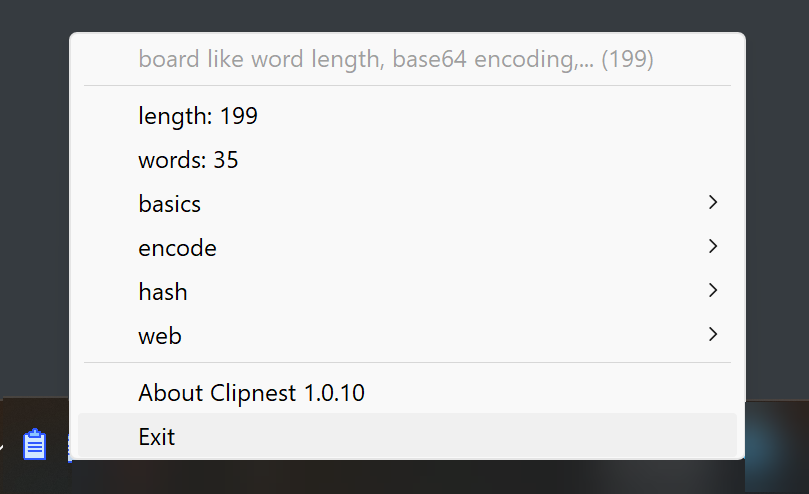

# Clipnest

Perform most common string operations on the clipboard like word length, base64 encoding, md5, sha256 hashes and so on with ease. Missing an operation? Raise an issue here and myself or any willing contributor will make it happen. You are welcome to contribute the code as well!

Aims to be incredibly fast and incredibly small.

## Installing

Go to [releases](https://github.com/aloneguid/clipnest/releases) section and download the latest zip with `.exe` to launch. It's self-contained and does not require any extra dependencies.

## Using

To perform a function on clipboard content, simply click the notification icon that pops up the list of available transformations. Click the transformation to copy the result of it back into the clipboard. That's it!

Note that transformations only appear when they *can be computed*, for instance, if clipboard content is not a base64-encoded string, then `base-64 decode` transformation will not appear in the popup.

## Supported Operations

- word length
- number of words
- encoding
  - base 64 encoding / decoding
- basics
  - convert to uppercase
  - convert to lowercase
  - trim
  - remove non-ASCII characters
- convert number to readable size
- hashing
  - [MD5](https://en.wikipedia.org/wiki/MD5)
  - SHA-256
  - SHA-512
- web utilities
  - strip HTML tags
  - format JSON
- data extraction
  - emails
  - IP addresses (v4 and v6)

## Building

To **build**, you need `cmake` and `C++ 20` and all the build steps are "documented" in github workflow file.

## Contributing

All **contributions** and feature requests are welcome. Donations are more than welcome to keep this going forward.
